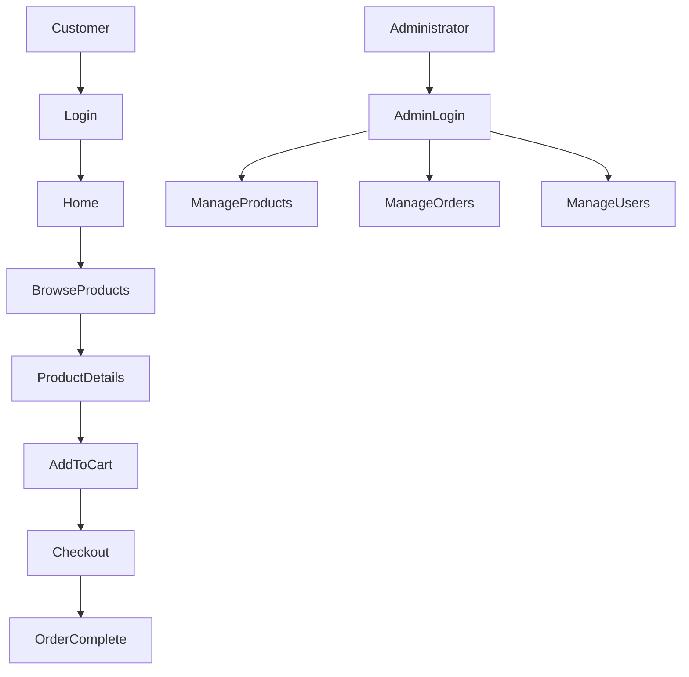

# E-Commerce Platform for Computer Hardware and Gaming Gears

## สมาชิก

- สุรวุฒิ บุญยู้
- เชษฐกิตติ์ สืบสุขสันติ
- รัชภูมิ ธรรมประชา
- ภูริภัทร ทองมวน

---

## หลักการและเหตุผล

ปัจจุบันความต้องการอุปกรณ์คอมพิวเตอร์และเกมมิ่งเกียร์เพิ่มสูงขึ้นอย่างต่อเนื่อง แต่ผู้ใช้งานจำนวนมากยังพบปัญหาในการค้นหาสินค้าและเลือกซื้อผ่านเว็บไซต์ที่มีการจัดหมวดหมู่ไม่ชัดเจน คณะผู้จัดทำจึงได้พัฒนาระบบ E-Commerce Platform ขึ้น เพื่อจำลองแพลตฟอร์มซื้อขายอุปกรณ์คอมพิวเตอร์และเกมมิ่งเกียร์ที่ใช้งานง่าย มีการจัดหมวดหมู่สินค้าอย่างเป็นระบบ และช่วยให้ผู้ใช้งานสามารถค้นหาและสั่งซื้อสินค้าได้อย่างสะดวก

---

## วัตถุประสงค์

- พัฒนาเว็บแอปพลิเคชันสำหรับซื้อขายอุปกรณ์คอมพิวเตอร์และเกมมิ่งเกียร์
- พัฒนาระบบตะกร้าสินค้าที่สามารถคำนวณราคารวมได้อย่างถูกต้อง
- อำนวยความสะดวกในการค้นหาและเลือกซื้อสินค้า
- พัฒนาระบบจัดการสินค้าและคำสั่งซื้อสำหรับผู้ดูแลระบบ

---

## ขอบเขตของระบบ

### ผู้ใช้งาน

- ลูกค้า (Customer)
- ผู้ดูแลระบบ (Administrator)

### ความสามารถของระบบ

- สมัครสมาชิก
- เข้าสู่ระบบ
- ดูรายการสินค้า
- ค้นหาสินค้า
- เพิ่มสินค้าเข้าตะกร้า
- สั่งซื้อสินค้า
- ผู้ดูแลระบบจัดการสินค้า
- ผู้ดูแลระบบจัดการคำสั่งซื้อ

---

## แนวทางการพัฒนาตาม SDLC

1. วิเคราะห์ความต้องการของระบบ
2. วางแผนโครงงาน
3. ออกแบบ UI/UX ด้วย Figma
4. ออกแบบฐานข้อมูล
5. พัฒนาระบบด้วย React และ Node.js
6. ทดสอบระบบ
7. นำระบบขึ้นใช้งาน
8. ปรับปรุงและแก้ไขข้อผิดพลาด

---

## เครื่องมือและเทคโนโลยีที่ใช้

### Frontend

- HTML
- CSS
- JavaScript
- React
- Bootstrap

### Backend

- Node.js

### Database

- Local Storage

### Design Tool

- Figma

### Version Control

- Git
- GitHub
- SourceTree

---

## การทดสอบระบบ

### วิธีการทดสอบ

- Manual Testing
- User Acceptance Testing (UAT)

### สิ่งที่ทดสอบ

- การสมัครสมาชิกและเข้าสู่ระบบ
- การค้นหาและแสดงสินค้า
- การเพิ่มสินค้าเข้าตะกร้า
- การคำนวณราคารวม
- การสั่งซื้อสินค้า
- การจัดการสินค้าและคำสั่งซื้อของผู้ดูแลระบบ

---

## ผลลัพธ์ที่คาดว่าจะได้รับ

- ระบบสามารถแสดงรายการสินค้าได้อย่างถูกต้อง
- ระบบสามารถคำนวณราคารวมของตะกร้าสินค้าได้
- ระบบสามารถสรุปคำสั่งซื้อได้
- ข้อมูลสินค้าถูกจัดเก็บอย่างเป็นระบบ
- ข้อมูลผู้ใช้งานถูกจัดเก็บใน Local Storage

---

## แผนการดำเนินงาน

- วิเคราะห์และรวบรวมความต้องการ
- ออกแบบ UI/UX และฐานข้อมูล
- พัฒนาส่วน Frontend
- พัฒนาส่วน Backend
- ทดสอบระบบ
- แก้ไขข้อผิดพลาดและนำเสนอผลงาน

---

## System Architecture

