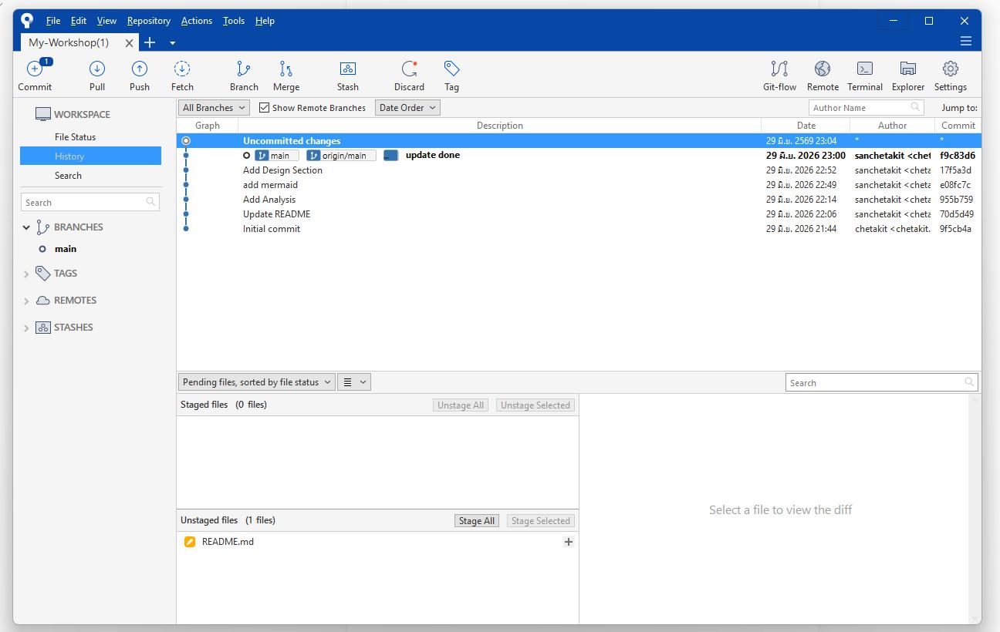
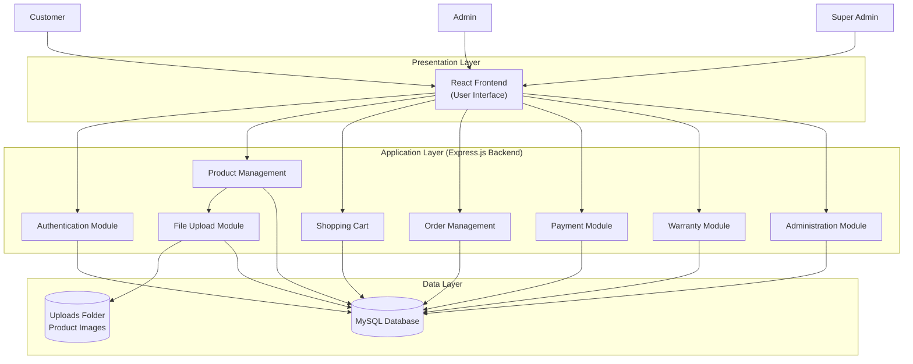
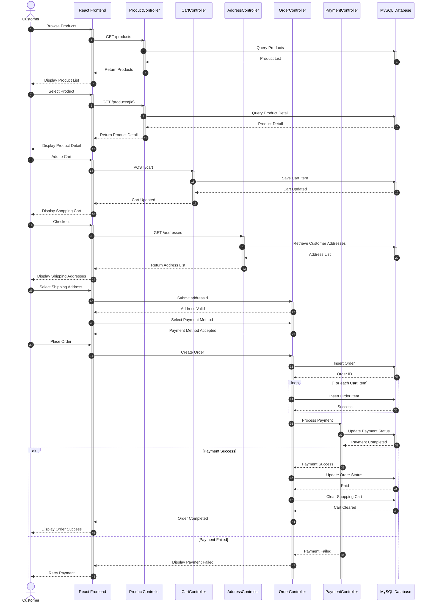
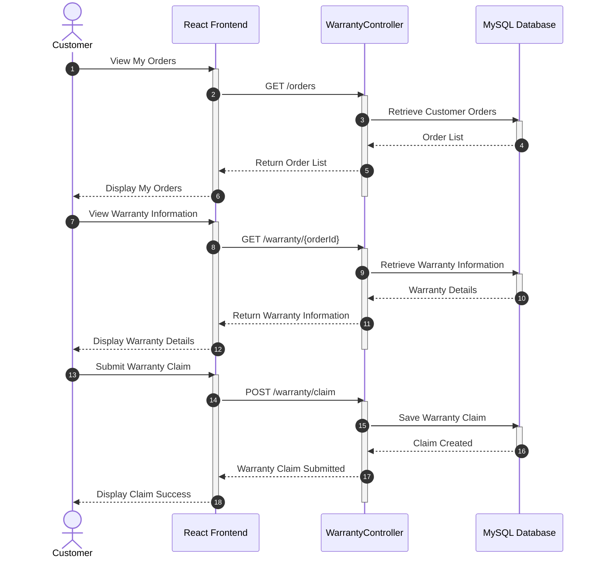
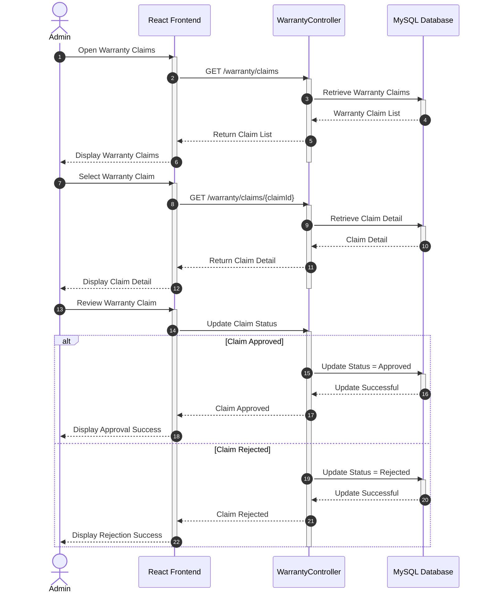
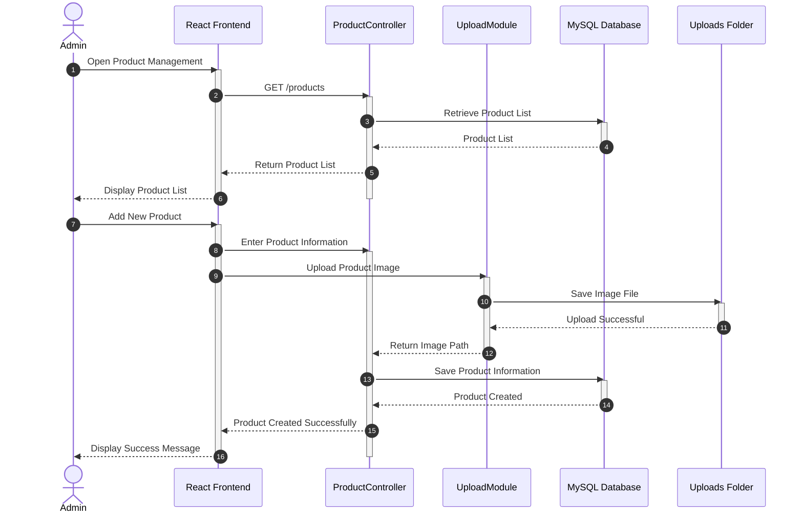
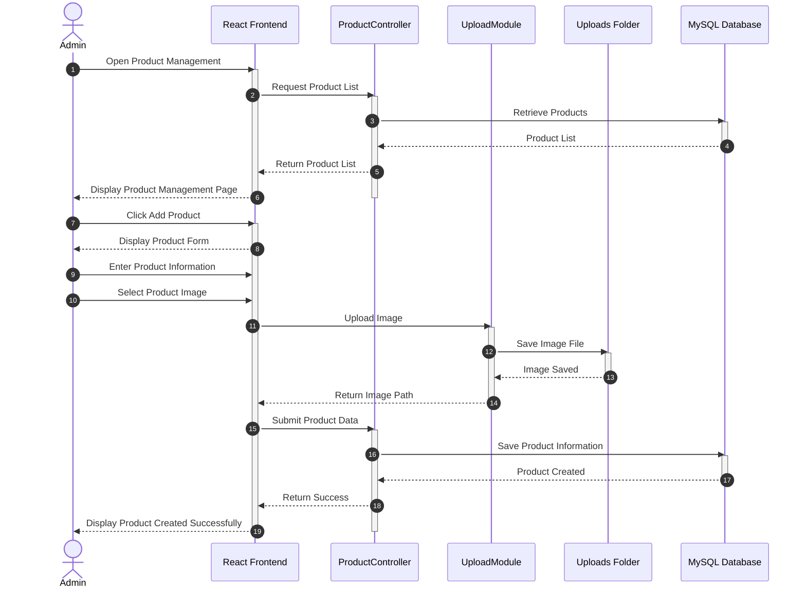
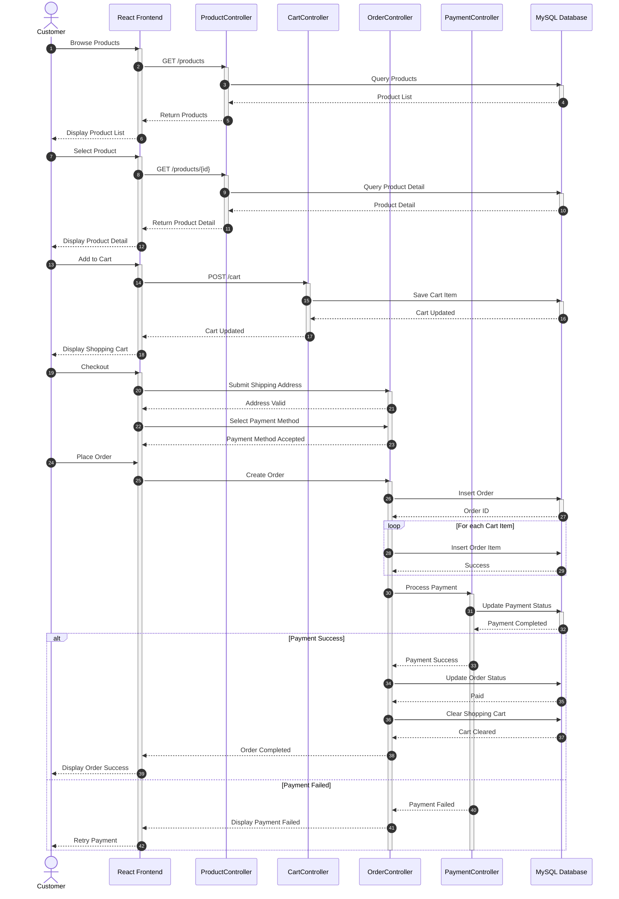

# E-Commerce Tlecomkub

## ลิ้งหน้าเว็ป
- [Document](https://rachapoomthu-max.github.io/WorkShop/)
- [LinkWeb](https://moo-tle-com-kub-ex3e.vercel.app/)
- [กระบวนการทดสอบ UAT](https://rachapoomthu-max.github.io/WorkShop/uat_checklist.html)

**สมาชิก**
- 67144643 สุรวุฒิ บุญยู้ ( Leader Dev & Project Manager )
- 67150490 เชษฐกิตติ์ สืบสุขสันติ ( Sorfware Developer & Qa Tester )
- 67159224 รัชภูมิ ธรรมประชา ( Software developer & Ui Designer )
- 67159844 ภูริภัทร ทองมวน ( Software developer & Ui Designer )

## หลักการและเหตุผล

- ปัจจุบันความต้องการอุปกรณ์คอมพิวเตอร์และเกมมิ่งเกียร์เติบโตขึ้นอย่างมาก แต่ผู้ซื้อมักเจอปัญหาร้านค้าออนไลน์ที่ใช้งานยากและจัดหมวดหมู่ซับซ้อน คณะผู้จัดทำจึงพัฒนาระบบ    E-commerce นี้ขึ้น เพื่อสร้างแพลตฟอร์มจำลองที่ซื้อขายง่าย ค้นหาสินค้าได้สะดวก และแยกหมวดหมู่อุปกรณ์ชัดเจน เพื่อตอบโจทย์พฤติกรรมของผู้บริโภคยุคดิจิทัลได้อย่างมีประสิทธิภาพ

## วัตถุประสงค์ของโครงงาน

โครงงานนี้จัดทำขึ้นเพื่อพัฒนาเว็บสำหรับการจำหน่ายอุปกรณ์คอมพิวเตอร์ผ่านระบบออนไลน์ โดยมุ่งเน้นการอำนวยความสะดวกแก่ผู้ใช้งานในการเลือกซื้อสินค้า การจัดการคำสั่งซื้อ และการบริหารจัดการข้อมูลภายในระบบ  โดยมีวัตถุประสงค์ดังต่อไปนี้

เพื่อพัฒนาเว็บแอปพลิเคชัน E-commerce สำหรับจำหน่ายอุปกรณ์คอมพิวเตอร์
เพื่อพัฒนาระบบจัดการข้อมูลสินค้าและหมวดหมู่สินค้าให้สามารถเพิ่ม แก้ไข ลบ และค้นหาข้อมูลได้อย่างมีประสิทธิภาพ
เพื่อพัฒนาระบบตะกร้าสินค้าและระบบสั่งซื้อที่สามารถคำนวณยอดชำระเงินได้อย่างถูกต้อง
เพื่อพัฒนาระบบจัดการข้อมูลสำหรับผู้ดูแลระบบ เพื่อรองรับการจัดการสินค้า คำสั่งซื้อ และข้อมูลลูกค้า
เพื่อพัฒนาระบบรายงานและ Dashboard สำหรับแสดงข้อมูลสรุปที่ช่วยสนับสนุนการบริหารจัดการร้านค้า
เพื่อศึกษาการพัฒนาเว็บแอปพลิเคชันด้วยเทคโนโลยีสมัยใหม่ และประยุกต์ใช้ในการพัฒนาระบบ E-commerce อย่างเป็นรูปธรรม

## ขอบเขตของระบบ (System Scope)

ระบบถูกออกแบบเพื่อรองรับการบริหารจัดการร้านค้าออนไลน์ โดยแบ่งผู้ใช้งานออกเป็น 3 ระดับ ได้แก่ ลูกค้า (Customer) ผู้ดูแลระบบ (Admin) และ ผู้จัดการระบบ (Super Admin) ซึ่งแต่ละระดับจะมีสิทธิ์และความสามารถในการใช้งานที่แตกต่างกัน เพื่อให้การดำเนินงานของระบบเป็นไปอย่างมีประสิทธิภาพ มีความปลอดภัย และสามารถบริหารจัดการข้อมูลได้อย่างเหมาะสม โดยมีรายละเอียดดังต่อไปนี้

## 1. ลูกค้า (Customer)

ลูกค้าเป็นผู้ใช้งานทั่วไปของระบบ มีหน้าที่ในการเลือกซื้อสินค้า จัดการข้อมูลส่วนตัว และติดตามการสั่งซื้อ โดยมีความสามารถดังนี้

## 1.1 การจัดการบัญชีผู้ใช้งาน
- สามารถสมัครสมาชิกเพื่อเข้าใช้งานระบบได้
- สามารถเข้าสู่ระบบ (Login) ได้
## 1.2 การค้นหาและเลือกซื้อสินค้า
- สามารถค้นหาสินค้าจากชื่อสินค้าได้
- สามารถเลือกดูสินค้าตามหมวดหมู่ได้
- สามารถดูรายละเอียดของสินค้าแต่ละรายการได้
## 1.3 การจัดการตะกร้าสินค้า
- สามารถเพิ่มสินค้าลงในตะกร้าได้
- สามารถแก้ไขจำนวนสินค้าในตะกร้าได้
- สามารถลบสินค้าออกจากตะกร้าได้
- สามารถตรวจสอบรายการสินค้าในตะกร้าได้
## 1.4 การสั่งซื้อสินค้า
- สามารถเลือกที่อยู่สำหรับการจัดส่งสินค้าได้
- สามารถชำระเงินผ่านระบบจำลอง (Simulation / Mock Payment) ได้
- สามารถตรวจสอบข้อมูลการสั่งซื้อก่อนยืนยันรายการได้
- สามารถยืนยันคำสั่งซื้อสินค้าได้
## 1.5 การติดตามคำสั่งซื้อ
- สามารถตรวจสอบสถานะของคำสั่งซื้อได้
- สามารถดูประวัติการสั่งซื้อทั้งหมดของตนเองได้
## 1.6 การจัดการที่อยู่จัดส่ง
- สามารถเพิ่มข้อมูลที่อยู่จัดส่งได้
- สามารถแก้ไขข้อมูลที่อยู่จัดส่งได้
- สามารถลบข้อมูลที่อยู่จัดส่งได้
  
## 2. ผู้ดูแลระบบ (Admin)

ผู้ดูแลระบบมีหน้าที่บริหารจัดการข้อมูลภายในร้านค้า รวมถึงติดตามคำสั่งซื้อและดูข้อมูลสรุปของระบบ โดยมีความสามารถดังนี้

## 2.1 การจัดการข้อมูลสินค้า
- สามารถเพิ่มข้อมูลสินค้าได้
- สามารถแก้ไขข้อมูลสินค้าได้
- สามารถลบข้อมูลสินค้าได้
- สามารถดูรายการสินค้าทั้งหมดได้
## 2.2 การจัดการหมวดหมู่สินค้า
- สามารถเพิ่มหมวดหมู่สินค้าได้
- สามารถแก้ไขหมวดหมู่สินค้าได้
- สามารถลบหมวดหมู่สินค้าได้
- สามารถดูรายการหมวดหมู่สินค้าได้
## 2.3 การจัดการคำสั่งซื้อ
- สามารถตรวจสอบรายการคำสั่งซื้อของลูกค้าได้
- สามารถอัปเดตสถานะคำสั่งซื้อได้
- สามารถติดตามความคืบหน้าของคำสั่งซื้อได้
## 2.4 การดูรายงานและ Dashboard
- สามารถดูรายงานสรุปข้อมูลการขายเบื้องต้นได้
- สามารถดู Dashboard แสดงข้อมูลสถิติของระบบได้
## 2.5 การจัดการข้อมูลลูกค้า
- สามารถค้นหาข้อมูลลูกค้าได้
- สามารถดูรายละเอียดข้อมูลลูกค้าได้
  
## 3. ผู้จัดการระบบ (Super Admin)

ผู้จัดการระบบเป็นผู้ใช้งานที่มีสิทธิ์สูงสุดในการบริหารจัดการระบบทั้งหมด สามารถกำหนดสิทธิ์ผู้ใช้งานและติดตามภาพรวมของระบบได้ โดยมีความสามารถดังนี้

## 3.1 การจัดการข้อมูลสมาชิก
- สามารถดูข้อมูลผู้ดูแลระบบทั้งหมดได้
- สามารถเพิ่มข้อมูลผู้ดูแลระบบได้
- สามารถแก้ไขข้อมูลผู้ดูแลระบบได้
- สามารถลบข้อมูลผู้ดูแลระบบได้
## 3.2 การจัดการสิทธิ์การใช้งาน
- สามารถกำหนดสิทธิ์การใช้งานของผู้ดูแลระบบ (Admin) ได้
- สามารถกำหนดสิทธิ์การใช้งานของลูกค้า (Customer) ได้
## 3.3 การดูรายงานและ Dashboard ภาพรวม
- สามารถดูและเข้าถึงฟังก์ชันทั้งหมดของผู้ดูแลระบบได้

## แนวทางการพัฒนาตาม SDLC

1. ประชุมเลือกหัวข้อ กำหนดขอบเขตระบบ และแบ่งงานในกลุ่ม
2. รวบรวมข้อมูลสินค้าและวิเคราะห์ความต้องการหน้าจอของระบบ
3. ออกแบบ UI/UX ด้วย Figma และออกแบบโครงสร้างฐานข้อมูล (Database Schema)
4. พัฒนา Frontend ด้วย React และพัฒนา Backend ด้วย Node.js เชื่อมต่อกับ MySQL
5. ทดสอบระบบด้วย Manual Testing และ User Acceptance Testing (UAT)
6. ปรับปรุงและแก้ไขข้อผิดพลาดของระบบ
7. จัดทำเอกสารและสรุปผลการพัฒนา

## เครื่องมือและเทคโนโลยีที่ใช้

### Frontend
- Vite with React

### Backend
- Node.js
- Express.js

### Database
- MySQL

### Authentication
- JWT (JSON Web Token)
- bcrypt

### Design Tool
- Figma

### Version Control
- Git
- GitHub
- SourceTree

### Development Tool
- Visual Studio Code

## แนวทางในการทดสอบระบบ

**ประเภทการทดสอบ**
- Manual Testing
- User Acceptance Testing (UAT)

ไม่วัดผลการใช้เครื่องมือทดสอบอัตโนมัติหรือมีการจัดทํารายงานผลการทดสอบอย่างเป็นทางการ
การทดสอบการทํางานของระบบด้วยตนเองตามฟังก์ชันทีพัฒนา พร้อมสาธิตการทํางานต่อผู ้สอน 
โดยอธิบายขั้นตอนการทดสอบผลลัพธ์ทีคาดหวังและผลลัพธ์ทีเกิดขึ้นจริง เพือแสดงให้เห็นว่าระบบทํางาน
ได้ถูกต้องตามวัตถุประสงค์ที่กําหนดไว้  

## ผลลัพท์ที่คาดว่าจะได้รับ

1. ระบบสามารถแสดงรายการสินค้าและราคาอุปกรณ์คอมพิวเตอร์แยกตามหมวดหมู่ได้อย่างถูกต้อง
2. ระบบสามารถบันทึก ปรับปรุง และคำนวณราคาสินค้าในตะกร้าของลูกค้าได้แบบเรียลไทม์
3. ระบบสามารถจำลองการออกใบสรุปยอดเงินและประวัติการสั่งซื้อหลังสิ้นสุดขั้นตอนชำระเงิน
4. ข้อมูลการเลือกซื้อสินค้าถูกจัดเก็บใน Local Storage ได้อย่างถูกต้องและปลอดภัยฝั่งผู้ใช้

## แผนการดำเนินงาน

1. เก็บรวบรวมความต้องการของระบบ, ออกแบบ UI/UX ด้วย Figma และออกแบบโครงสร้างฐานข้อมูล (Database Schema)น Local Storage ได้อย่างถูกต้องและปลอดภัยฝั่งผู้ใช้
2. เขียนโค้ดส่วนหน้าบ้านด้วย React เพื่อสร้างหน้าจอแสดงสินค้า หมวดหมู่ ตะกร้าสินค้า และหน้าจำลองสั่งซื้อ
3. พัฒนาส่วนหลังบ้านด้วย Node.js และสร้างฐานข้อมูล MySQL เพื่อใช้จัดการและเชื่อมต่อข้อมูลสินค้าและคำสั่งซื้อ
4. ทำการทดสอบระบบแบบ Manual Testing และทำ UAT ตรวจสอบความถูกต้อง พร้อมจัดทำสรุปเพื่อนำเสนอผลงาน

## User Interface Design (Home Page)

ภาพหน้าหลักของระบบ E-Commerce สำหรับแสดงสินค้า หมวดหมู่ และเมนูหลักของเว็บไซต์

## Screenshot SourceTree 

## System Architecture

## 1) แผนภาพกรณีการใช้งาน (Use Case Diagram)

.png)

หน้าที่ของแผนภาพ:
- แสดงขอบเขตของระบบ TechPulse ให้เห็นชัดว่าใครทำอะไรได้บ้าง
- ใช้ยืนยันขอบเขตงานกับสมาชิกในทีมและผู้สอน

ความสำคัญต่อการพัฒนาระบบ:
- ลดความเสี่ยงการตกหล่นฟังก์ชันสำคัญ เช่น ตรวจสิทธิ์และงานหลังบ้าน
- ใช้เป็นฐานในการกำหนดเส้นทางหน้าเว็บและสิทธิ์การเรียก API ตามบทบาท

## 2) แผนภาพคลาส (Class Diagram)

หมายเหตุ: แผนภาพนี้อ้างอิงชื่อโครงสร้างข้อมูลจริงในฐานข้อมูลของโครงการ

## Customer Purchase Flow

---

### Warranty Claim Flow (Customer)

---

### Manage Warranty Claim Flow (Admin)

---

### Admin Add Product Flow

---

### Admin Manage Order Flow

หน้าที่ของแผนภาพ:
- แสดงโครงสร้างข้อมูลหลักและความสัมพันธ์ระหว่างเอนทิตีในระบบ
- ใช้อ้างอิงร่วมกันระหว่างการออกแบบฐานข้อมูลและการพัฒนาโมเดล

ความสำคัญต่อการพัฒนาระบบ:
- ลดความกำกวมของข้อมูล เช่น ความสัมพันธ์ Order กับ OrderItem และ Payment
- ป้องกันการออกแบบซ้ำซ้อน ทำให้พัฒนา Controller และ Service ได้สอดคล้องกัน

## 3) แผนภาพลำดับงาน (Sequence Diagram)

กรณีศึกษา: ลำดับการทำงานของการสั่งซื้อและการชำระเงินในระบบจริง

หน้าที่ของแผนภาพ:
- แสดงลำดับการเรียกใช้งานจริงจากผู้ใช้ไปจนถึงฐานข้อมูล
- ช่วยให้ทีมเห็นจุดที่ต้องมีการตรวจสอบสิทธิ์ ตรวจสต็อก และควบคุมธุรกรรม

ความสำคัญต่อการพัฒนาระบบ:
- ทำให้มองเห็นจุดเสี่ยงด้านความถูกต้องของข้อมูล เช่น การตัดสต็อกซ้ำ
- ใช้ระบุจุดคอขวดที่ทำให้ระบบช้าในช่วงผู้ใช้หนาแน่น
